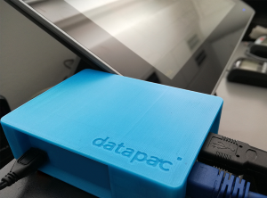

# Datapac OEC

Dokumentácia a podpora k Datapac OEC.

Datapac OEC je certifikovaný online eKasa klient.



# Popis dokumentov

[OEC.LAN Standalone quickstart.docx](https://github.com/datapacsro/oec/blob/master/OEC.LAN%20Standalone%20quickstart.docx) - quickstart ako začať s OEC. Popis nastavenia testovacieho prostredia eKasa

[Datapac OEC API Howto.docx](https://github.com/datapacsro/oec/blob/master/Datapac%20OEC%20API%20Howto.docx) - príklady použitia API

[OEC.LAN pouzivatelsky manual.docx](https://github.com/datapacsro/oec/blob/master/OEC.LAN%20pouzivatelsky%20manual.docx) - používateľský manuál. Popisuje nastavenie siete, zapojenie, podporované tlačiarne atď.

[API docs](https://datapacsro.github.io/oec/) - podrobná dokumentácia k API

[API docs swagger](https://app.swaggerhub.com/apis-docs/Datapac/PPEKK/7.0.0)

[codesamples](codesamples) - príklad kódu v C#

[Releases](https://github.com/datapacsro/oec/releases) - aktualizácie dostupné pre OEC.LAN Standalone

# Wiki
[Wiki k Datapac OEC](https://github.com/datapacsro/oec/wiki)

# Verzie
OEC je dostupné v niekoľkých verziách
- OEC.LAN Standalone - samostatné zariadenie (modrá krabička), ktoré využíva pokladňa na registráciu dokladov. Stačí ho pripojiť k LAN a pripjiť doň tlačiareň. 
- OEC.Android Swissbit - aplikácia pre podporované Android zariadenia, ktoré obsahujú aj vstavanú tlačiareň. Dá sa využiť s externou alebo integrovanou Android pokladňou

# Contribution
V prípade, že sa rozhodnete pomôcť a prispieť či už opravou dokumentácie, príkladov použitia API, článkom do Wiki, pomôžete aj ostatným. Sme otvorení tomuto prístupu, preto neváhajte.

## Help me help you
1. [git clone](https://github.com/datapacsro/oec.git) 
```bash
git clone https://github.com/datapacsro/oec.git
```
2. spraviť vlastný branch
4. commitnúť zmeny
5. [pull request](https://github.com/datapacsro/oec/pulls)

# Podpora k OEC
Požiadavky a chyby reportujte cez [Issues](https://github.com/datapacsro/oec/issues) k tomuto repository.


